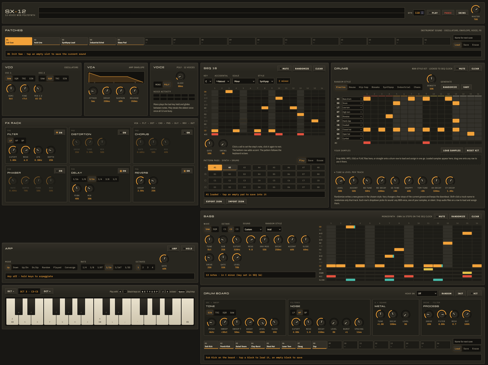

# SX-12

**A 12-voice polysynth, 808-style drum machine, drum synthesizer and acid bass sequencer in a single HTML file.**

SX-12 runs entirely in the browser on the Web Audio API. There's no build step, no framework, no server and no dependencies. Open `index.html` and play.



---

## Contents

- [Quick start](#quick-start)
- [What's on the panel](#whats-on-the-panel)
- [Keyboard and mouse](#keyboard-and-mouse)
- [Signal flow](#signal-flow)
- [Saving, export and import](#saving-export-and-import)
- [Browser support](#browser-support)
- [Known limitations](#known-limitations)
- [Project layout](#project-layout)
- [Contributing](#contributing)
- [License](#license)

---

## Quick start

1. Download or clone the repository.
2. Open `index.html` in a current desktop browser (Chrome, Edge, Firefox or Safari).
3. Press **Play**. The factory groove (lead sequence, drums and bass) starts at 118 BPM.

Browsers start audio only after you interact with the page, so the first click or key press switches the sound on.

To serve it locally instead of opening the file directly:

```sh
python3 -m http.server 8000
# then browse to http://localhost:8000
```

The page loads three typefaces from Google Fonts (Michroma, Orbitron and Silkscreen). If you're offline it falls back to system fonts, and everything else works unchanged.

---

## What's on the panel

The screenshot above follows the layout from top to bottom. On wide screens the modules arrange themselves side by side. On narrow screens they stack into a single column, and the step grids scroll sideways inside their own panels.

### Header and transport

| Control | What it does |
|---|---|
| Oscilloscope | Live waveform of the master output |
| **BPM** | Tempo from 40 to 240. The delay time follows it. |
| **Play** | Starts and stops SEQ 16, the drums and the bass together on one clock |
| **Panic** | Silences every voice and stops playback |
| **Skins** | Opens the skin browser and editor |
| **Master** | Output level |

### Patches

16 slots that store the **lead synth sound**: oscillators, envelope, voice mode and every FX setting. Five factory sounds are included: *Init Saw, Acid Line, Synthpop Lead, Industrial Grind* and *Glass Pad*.

- Tap a filled slot to load it.
- Tap an empty slot to save the current sound, named from the name field.
- **Save** overwrites a filled slot and **Erase** clears one.

### VCO · VCA · Voice

- **VCO**: two oscillators (SAW / SQR / TRI / SIN), Semi (±24), Fine (±50 cents) and a crossfade Mix.
- **VCA**: ADSR amp envelope with a live envelope graph.
- **Voice**:
  - **Poly** gives 12 voices with oldest-voice stealing.
  - **Mono** plays the last key held and glides between notes, with an adjustable Glide time.
  - Voice-activity LEDs show which voices are sounding.

### FX rack

Six effects in series, each with its own on/off switch:

| # | Effect | Controls |
|---|---|---|
| FX1 | **Filter** | LP / HP / BP, Cutoff, Reso, LFO rate and depth |
| FX2 | **Distortion** | Drive, Tone, Mix |
| FX3 | **Chorus** | Rate, Depth, Mix (stereo) |
| FX4 | **Phaser** | 4-stage, Rate, Depth, Feedback, Mix |
| FX5 | **Delay** | Tempo-synced (1/16 to 1/2), Feedback, Mix |
| FX6 | **Reverb** | Decay, Mix |

### SEQ 16 and pattern pads

- **SEQ 16**: a 16-step note sequencer with 13 note rows and an accent row, plus Gate and Swing.
- **Key-aware Randomize** writes notes in the chosen key:
  - **Key and Accidental:** C–B with ♮, ♯ or ♭.
  - **Scale:** Major, Minor, Harmonic minor, Dorian, Phrygian, Mixolydian, Pentatonic major and minor, or Blues.
  - **Style:** Synthpop, Industrial, Electro, House, Hip-hop, Breaks, Acid or Chaos. Each style sets the rhythm, which notes are favored, the jump size, the accents, and the Gate and Swing.
  - **Grid:** rows outside the key are dimmed and the root is highlighted.
- **Pattern pads** (banks A–D × 8): each pad stores the SEQ 16 notes, all drum tracks and accents, and the bass line.
  - **While playing:** tapping a pad queues it, and it switches in on the next bar.
  - **While stopped:** tapping a pad loads it and starts playback.
  - **Export JSON / Import JSON:** backs up the pads, patches, drum blocks, scenes, BPM and key in one file.

### Drums

An 808-style drum machine with ten tracks: BD, SD, LT, HT, RS, CP, CB, CH, OH and CY. Every sound is synthesized; no samples are used by default.

- **Kit knobs:** Level, Accent, BD Tune and Decay, SD Tone, Snappy, Tom Tune, OH Decay, CY Decay.
- **Closed hat chokes the open hat**, as on the original machine.
- **Random style:** Electro, House, Hip-hop, Breaks, Synthpop, Industrial or Chaos. There's also a Density control.
  - **Randomize** writes a new groove.
  - **Vary** changes a few steps and keeps the downbeat.
  - **Shift-click** a track name to randomize only that track.
- **Sound per track:** each row's dropdown picks any 808 voice, a Drum Board block, the live board, one of your samples, or Silent.
- **Your samples:**
  - Load WAV, MP3, OGG, FLAC, AIFF or M4A files with the button, or drop them straight onto a drum row.
  - Samples are peak-normalized when loaded and stored in IndexedDB.
- **Tune & level per track:** ±12 semitones and 0–150 %. These work on 808 voices, samples and synthesized drums.

### Bass

A monophonic bass synth with its own 16-step sequence, running on the same clock.

- **Sound:**
  - Saw or square oscillator plus a sub-oscillator, through two lowpass filter stages in series (24 dB/oct).
  - Cutoff, Reso, Env Mod, Decay, Accent, Slide, Drive, Gate, Tune and Level, plus a C1–C3 octave switch.
  - Five starting sounds: Acid, Deep sub, Pluck, Industrial grit and Rubber.
- **Steps:** 13 note rows plus **UP**, **DOWN**, **ACC** (accent) and **SLIDE** flag rows. A slid note glides into the next step without retriggering.
- **Randomize** writes in-key bass lines in eight styles and follows SEQ 16's key.

### Drum Board

A drum synthesizer for designing your own hits. It has four layers:

| Layer | Controls |
|---|---|
| **Tone** | Waveform, Pitch, Sweep (up to 4 octaves), Sweep time, Decay, Level, Click |
| **Noise** | LP/HP/BP filter, Cutoff, Reso, Decay, Level, and a Burst count with Spacing for claps |
| **Metal** | The 808's six-square-wave cluster, with Tune, Decay, Level |
| **Process** | Drive, Filter, Reso, Out |

- **Hit** auditions the sound, **Random** makes a new playable drum, and **Init** resets the board.
- **Hear on** routes the board live to any drum track, so you can shape a sound while the pattern plays.
- **16 save blocks**, eight of them pre-filled: Sub Kick, Punch Kick, Gated Snare, Clap Burst, Steel Hat, Laser Tom, Clang and Zap. Saved blocks appear in every drum row's dropdown, and a block's label shows which tracks use it.

### Scenes

**Save all** captures the entire instrument into one of 16 recall buttons:
- BPM, key and the random styles
- The lead patch, master level and keyboard octave
- The arpeggiator settings
- All three patterns and their mutes
- The drum knobs and the kit
- The Drum Board and the bass sound

Recalling while playing switches on the next bar. **Export all**, **Export current** and **Load JSON** move scenes between browsers. A single exported scene carries copies of the Drum Board blocks it uses.

### Arpeggiator

- **Modes:** Up, Down, Up/Dn, Dn/Up, Random, Played and Converge.
- **Rate:** 1/4, 1/8, 1/8T, 1/16, 1/16T or 1/32, over 1–4 octaves, with a Gate control.
- **Hold** latches the chord.

### Keyboard

- A two-octave keyboard you can play with the mouse, touch or the computer keyboard.
- **Oct −** and **Oct +** shift it across 8 octaves.

### Skins

- Six built-in skins: *Graphite* (default), *Base Skin 97*, *Rhythm Composer*, *Ivory Lab* (light), *Synthwave* and *Phosphor*.
- A live editor with 16 color pickers, fonts for headings, labels and readouts, and light or dark styling for form controls.
- An optional background image (Cover or Tile) with see-through panels.
- Skins export and import as small JSON files.

---

## Keyboard and mouse

| Input | Action |
|---|---|
| `A W S E D F T G Y H U J K O L P ; '` | Play notes. The white keys are on the home row and the black keys on the row above. |
| `Z` / `X` | Octave down / up |
| `Space` | Play / stop |
| Drag a knob up or down | Change its value. Hold **Shift** for fine control. |
| Mouse wheel over a knob | Change its value |
| Arrow keys on a focused knob | Step the value. `Home` / `End` jump to the minimum / maximum. |
| Double-click a knob | Reset it to its default |
| Shift-click a drum track name | Randomize that track only |
| Drag an audio file onto a drum row | Load it and assign it to that row |

Shortcuts are ignored while you're typing in a text field or dropdown.

---

## Signal flow

```
Lead voices (12) ─► Filter ─► Distortion ─► Chorus ─► Phaser ─► Delay ─► Reverb ─┐
808 / sample / Drum Board drums ─► per-track level ─► drum bus ─────────────────────┤
Bass monosynth ─► 2× lowpass ─► VCA ─► drive ───────────────────────────────────────┤
                                                                                    ▼
                                   Master ─► compressor ─► soft-clip safety ─► output
```

- **Gain staging:** each section is trimmed so the default mix peaks well below full scale.
- **Resonance compensation:** the lead, bass and Drum Board filters take back most of the boost that high resonance adds.
- **Delay feedback:** the loop has no resonant boost and runs through a soft saturator, so echoes always decay, even at maximum Feedback.
- **Output safety:** a soft-clip stage after the master compressor stops the output from ever exceeding full scale. Extreme settings saturate gently instead of clipping.

---

## Saving, export and import

Everything is stored **in your browser**, on this device, for the page's origin. Nothing is uploaded anywhere.

| Data | Storage key | In Export JSON? |
|---|---|---|
| Pattern pads (32) | `sx12.pads.v1` | ✅ |
| Patches (16) | `sx12.patches.v1` | ✅ |
| Drum Board blocks (16) | `sx12.drumblocks.v1` | ✅ |
| Scenes (16) | `sx12.scenes.v1` | ✅ |
| Current Drum Board | `sx12.drumboard.v1` | Inside scenes |
| Drum kit assignments | `sx12.kit.v1` | Inside scenes |
| Bass sound | `sx12.bass.v1` | Inside scenes |
| Skin | `sx12.skin.v1` | Separate skin export |
| Audio samples | IndexedDB `sx12` → `samples` | ❌ (too large; keep your original files) |

- **Pads → Export JSON** writes a full backup (`"format": "sx12-pads"`) of the pads, patches, drum blocks, scenes, BPM and key.
- **Scenes → Export all / Export current** writes `"sx12-scenes"` (16 slots) or `"sx12-scene"` (one scene).
- **Skins → Export JSON** writes `"sx12-skin"`. Any background image is embedded as a data URL.

Every import is validated before anything changes. A malformed file shows an error and leaves your current data alone.

Clearing site data, using a private window or exceeding the browser's storage quota can erase saved data, so export anything you want to keep.

---

## Browser support

SX-12 targets current evergreen browsers:

| Browser | Status |
|---|---|
| Chrome / Edge 105+ | Fully supported (primary test target) |
| Safari 16+ | Supported |
| Firefox 110+ | Supported. Firefox lacks `cancelAndHoldAtTime`, and SX-12 includes a fallback that keeps release tails intact. |

It relies on the Web Audio API, CSS container queries and `color-mix()`. A fallback keeps panels solid in browsers without `color-mix()`.

---

## Known limitations

- **Step grids need a mouse or touch.** They aren't navigable with the keyboard yet. Knobs and buttons are.
- **Drag-and-drop of audio files** needs a mouse. On phones and tablets, use **Load samples** and the dropdowns.
- **Samples aren't included in JSON exports.** Reload the same audio files on another device. Until then, tracks using them fall back to their 808 sound.
- **Skins are themes, not bitmap skins.** Classic `.wsz` skin files can't be loaded.
- **No MIDI input or audio recording** yet.

---

## Project layout

```
.
├── index.html          # the whole app: markup, styles and script
├── docs/
│   └── screenshot.png  # the screenshot used above
├── LICENSE             # GNU General Public License v3
└── README.md
```

The script is organized into clearly commented sections: the audio engine, the drum voices, the bass monosynth, the scheduler, the UI widgets, each panel, then pads, scenes and skins.

---

## Contributing

Issues and pull requests are welcome.

- **Keep it a single file** with no dependencies and no build step.
- **Test with sound playing:** play each module and listen for clicks, stuck notes and clipping.
- **Check widths:** test at phone width (about 400px) and on a wide desktop screen.
- **License:** by contributing, you agree that your contributions are licensed under the GPL-3.0-or-later.

---

## License

SX-12 — 12-voice web polysynth, drum machine and bass sequencer
Copyright © 2026 crow (sigmablack)

This program is free software: you can redistribute it and/or modify it under the terms of the **GNU General Public License** as published by the Free Software Foundation, either **version 3** of the License, or (at your option) any later version.

This program is distributed in the hope that it will be useful, but **WITHOUT ANY WARRANTY**; without even the implied warranty of MERCHANTABILITY or FITNESS FOR A PARTICULAR PURPOSE. See the GNU General Public License for more details.

You should have received a copy of the GNU General Public License along with this program. If not, see <https://www.gnu.org/licenses/>. The full text is in [`LICENSE`](LICENSE).

The fonts loaded from Google Fonts (Michroma, Orbitron, Silkscreen, IBM Plex Sans Condensed and IBM Plex Mono) are licensed separately under the SIL Open Font License and aren't distributed with this repository.
